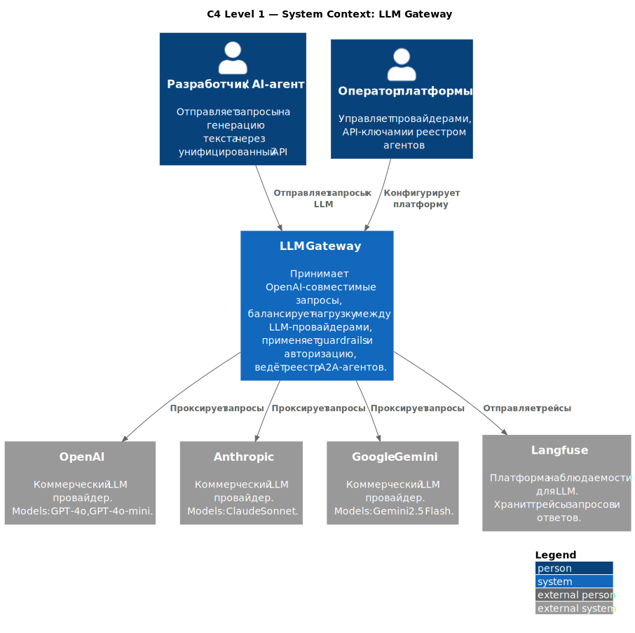
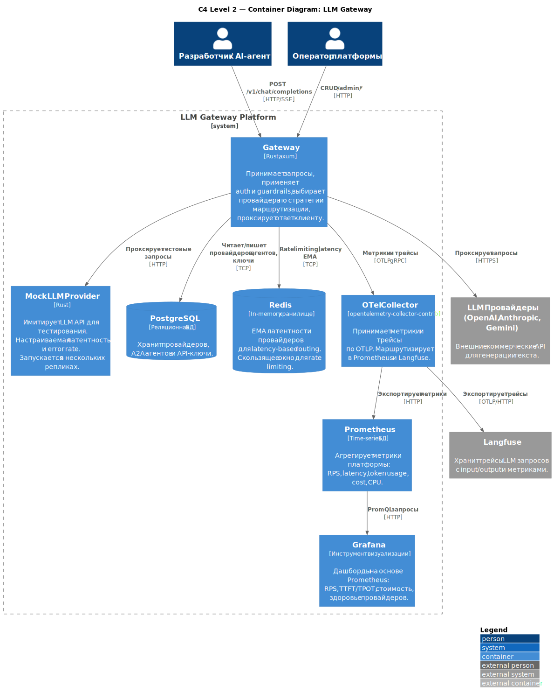
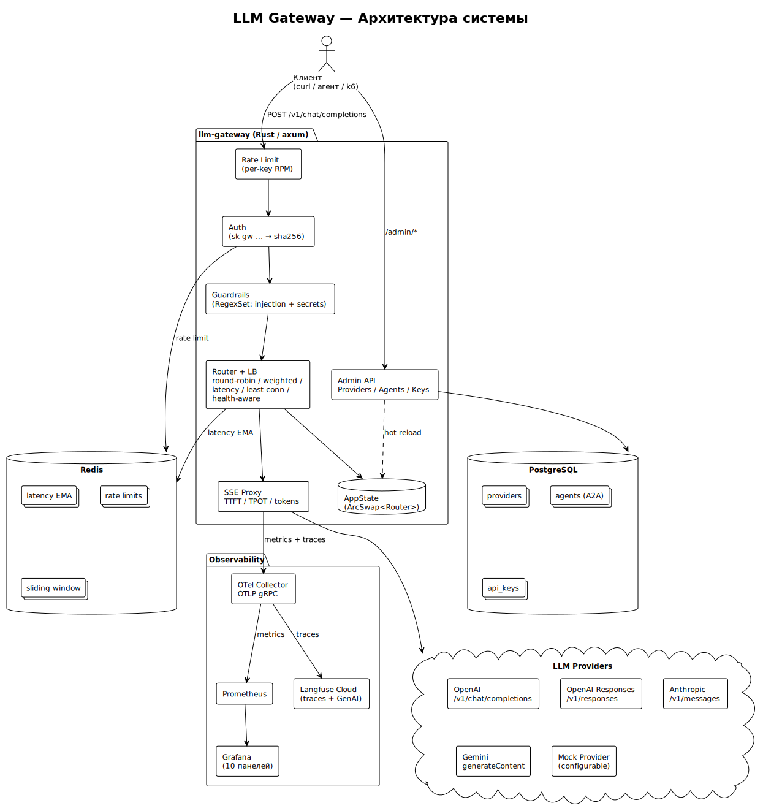
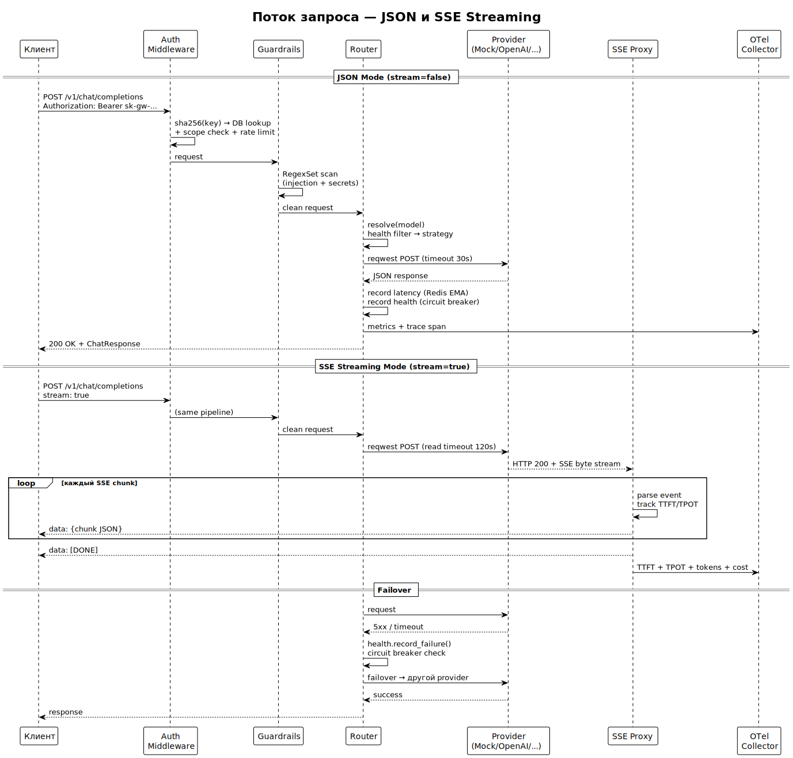
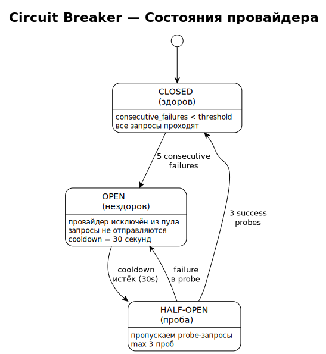

# Архитектура

## C4 Level 1 — System Context



## C4 Level 2 — Container Diagram



## Общая схема (компонентная)



Gateway принимает OpenAI-совместимые запросы на `POST /v1/chat/completions`, выбирает провайдера через routing strategy и проксирует запрос. Ответ возвращается клиенту as-is (JSON) или через SSE proxy (streaming).

## Поток запроса



Middleware pipeline (Tower layers, порядок сверху вниз):

1. **Body size limit** — отсекает payload больше 1MB
2. **Auth** — `sha256(Bearer token)` → lookup в `api_keys`, проверка scope и expiration, rate limit через Redis sliding window
3. **Guardrails** — RegexSet scan тела запроса на injection + secrets
4. **Router** — `model` → список backend'ов → strategy выбирает один
5. **Provider call** — reqwest HTTP к LLM
6. **Response** — JSON напрямую или SSE proxy с inline метриками

## Routing

5 стратегий:

| Стратегия | Алгоритм | Когда использовать |
|-----------|----------|-------------------|
| `round-robin` | `AtomicUsize % backends.len()` | Default, равномерная нагрузка |
| `weighted` | Cumulative weights, WRR | Разные мощности провайдеров |
| `latency` | Redis EMA (decay 0.3, 5min window) | Приоритет быстрому |
| `least-connections` | `AtomicUsize` per provider in-flight | Длинные запросы разной длительности |
| `health-aware` | Round-robin с фильтром по health | Автоматический обход нездоровых |

Все стратегии фильтруют unhealthy провайдеров через circuit breaker.

## Circuit Breaker



Per-provider state machine в `HealthTracker` (RwLock<HashMap>):

- **Closed** → Open: 5 consecutive failures (429, 5xx, timeout)
- **Open** → HalfOpen: после 30s cooldown
- **HalfOpen** → Closed: 3 successful probes
- **HalfOpen** → Open: любой failure

Параметры настраиваются в `[circuit_breaker]` секции TOML.

## Failover

При ошибке от primary провайдера:
1. `ProviderError.retryable == true` (429, 500-504, timeout)
2. Gateway вызывает `router.failover(model, failed_provider)`
3. Выбирается другой healthy провайдер для той же модели
4. Retry на нём — **не** на том же

Для SSE: TTFT timeout (`ttft_timeout_ms`, default 5s) — если первый токен не пришёл, cancel и failover до отправки первого байта клиенту.

## Hot Reload

`ArcSwap<Router>` — lock-free reads, atomic swap при изменении.

При CRUD через `/admin/providers`:
1. Пишем в PostgreSQL
2. `reload_router()` читает все active providers из DB + TOML config
3. Строит новый `Router` с weights, costs, strategy
4. `ArcSwap::store(new_router)` — атомарная подмена
5. In-flight запросы дорабатывают со старым Router через `Guard<Arc<Router>>`

## Provider Abstraction

`LlmProvider` trait — единый интерфейс для всех LLM:

```rust
pub trait LlmProvider: Send + Sync {
    fn name(&self) -> &str;
    fn models(&self) -> &[String];
    fn chat_completion(&self, request) -> Result<ChatResponse>;
    fn chat_completion_stream(&self, request) -> Result<reqwest::Response>;
}
```

5 реализаций, каждая транслирует OpenAI формат в нативный API:

| Provider | API | Auth | Особенности |
|----------|-----|------|-------------|
| OpenAI | `/v1/chat/completions` | Bearer | Прямой proxy |
| OpenAI Responses | `/v1/responses` | Bearer | `input` вместо `messages` |
| Anthropic | `/v1/messages` | `x-api-key` | `content_block_delta` SSE, 529 overloaded |
| Gemini | `generateContent` | `x-goog-api-key` | `user`/`model` roles, camelCase |
| Mock | OpenAI-compatible | — | Настраиваемая латентность, error rate |

`Pin<Box<dyn Future>>` вместо `async fn` в trait — потому что trait используется как `dyn LlmProvider` (dynamic dispatch). `async fn` в trait возвращает `impl Future` — не object-safe.

## Observability

```
Gateway → OTLP gRPC → OTel Collector → Prometheus (metrics)
                                      → Langfuse Cloud (traces)
```

Метрики (GenAI Semantic Conventions):
- `llm_gateway.requests.total` — counter, labels: provider, model, status
- `gen_ai.client.operation.duration` — histogram (p50/p95/p99)
- `gen_ai.server.time_to_first_token` — histogram
- `gen_ai.server.time_per_output_token` — histogram
- `gen_ai.client.token.usage` — counter, labels: direction (input/output)
- `llm_gateway.request.cost` — counter, USD
- `process.cpu.utilization` — gauge (sysinfo, каждые 10s)
- `process.memory.usage` — gauge

Langfuse traces (OpenTelemetrySpanExt):
- `gen_ai.operation.name`, `gen_ai.request.model`, `gen_ai.system`
- `gen_ai.usage.input_tokens`, `gen_ai.usage.output_tokens`
- `langfuse.observation.input` / `output` — для Input/Output полей в UI

## Design Decisions

| Решение | Альтернатива | Почему |
|---------|-------------|--------|
| `backon` для retry | `backoff` | backoff deprecated (RUSTSEC-2025-0012) |
| Свой circuit breaker | `failsafe` crate | Проще интеграция, per-provider state |
| TOML config | YAML | serde_yaml deprecated, TensorZero pattern |
| `fred` для Redis | `redis-rs` | Built-in metrics, pub/sub, async |
| `ArcSwap` для hot reload | `RwLock<Router>` | Lock-free reads на hot path |
| `RegexSet` для guardrails | Per-pattern iteration | Single-pass O(n) |
| Свой load tester | k6 | k6 не поддерживает SSE, нативный Rust |
